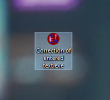
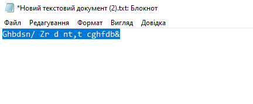
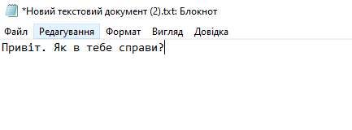
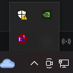
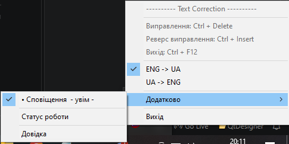

## Windows
Запустіть файл `Correction of entered text.exe`, програма запуститься у системному треї. \

Для того щоб виправити введений текст, потрібно виділити невірний фрагмент тексту та натиснути комбінацію клавіш `Ctrl + F12`. Програма сама виріже текс, виправить його та вставить замість помилкового. \

Також якщо натиснути правою кнопкою миші, то відкриється додаткове функціональне меню. \

---
### !
У файлі 'keyboardLayout.go' міститься масив даних з декодуванням символів. Можна змінити декодування в залежності від вашої клавіатури.
